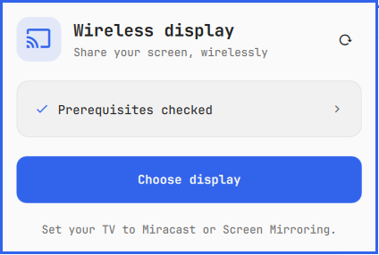
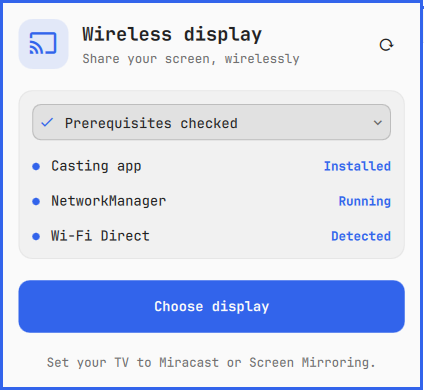

# Wireless Display Cast

Omarchy bar plugin `shady.wireless-display-cast`. Click the cast icon to check
prerequisites and open GNOME Network Displays. It owns receiver discovery,
connection progress, screen selection, and disconnect controls. This plugin
does not infer an active cast from whether the app is running.

## Interface




A compact, theme-aware panel with a cast icon, a prerequisites card, an
accent-colored **Choose display** button, and a refresh icon. While every
prerequisite passes, the card collapses to a single **Prerequisites checked**
row; click it (or press Enter/Space on it) to reveal the Casting app,
NetworkManager, and Wi-Fi Direct rows. Anything missing, pending, or
unreadable keeps those rows visible. Status labels remain readable without
relying on color. Keyboard users can Tab between controls, activate them with
Enter or Space, and press Escape to close.

Detailed instructions stay here; the panel shows a short receiver setup hint.
Missing-backend instructions appear only when needed.

## Requirements

Install the Miracast backend: `omarchy pkg aur add gnome-network-displays`.
GNOME Network Displays needs compatible Wi-Fi Direct hardware, NetworkManager
with wpa_supplicant, video/audio codecs, and a working screen-sharing portal
and PipeWire on Wayland. Keep your receiver in its Miracast mode.

Upstream setup and troubleshooting:
https://github.com/GNOME/gnome-network-displays/blob/master/README.md

## Use

1. Click the Wireless Display Cast bar icon.
2. Click **Choose display** and select your receiver.
3. Approve a screen in the sharing prompt.
4. Disconnect through GNOME Network Displays when finished.

If audio stays local, select the Network-Displays output in audio settings.
The plugin never starts sharing automatically or changes network configuration.
The prerequisite check is advisory, not an end-to-end casting test.

## Known issues

GNOME Network Displays 0.99.0 aborts with SIGABRT every time its window is
closed. The cast itself is unaffected and nothing is lost, but Omarchy shows a
"Process crashed" notification. It is an upstream use of an uninitialized
`g_autofree` pointer in the PulseAudio teardown path, already fixed in GNOME's
git but not yet released. See [docs/crash-on-close.md](docs/crash-on-close.md)
for the diagnosis and a PKGBUILD patch workaround.

## Install from GitHub

```sh
omarchy plugin add https://github.com/shadyuop/omarchy-wireless-display-cast --enable
```

Requires an Omarchy version with shell plugin support. The plugin uses Bash,
`jq`, `nmcli`, and `systemctl` to check prerequisites. Installing the plugin does
not install GNOME Network Displays automatically.

## Local installation

Copy this directory to `~/.config/omarchy/plugins/shady.wireless-display-cast`,
then run `omarchy-shell shell rescanPlugins` and
`omarchy plugin enable shady.wireless-display-cast`.

Disable with `omarchy plugin disable shady.wireless-display-cast`.
Validate with `omarchy plugin validate .` and `bash -n cast-helper`.

## License

[MIT](LICENSE) © 2026 Shady S. Samuel.
